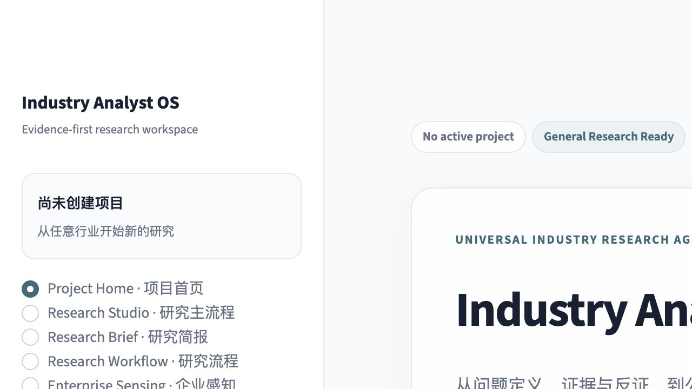
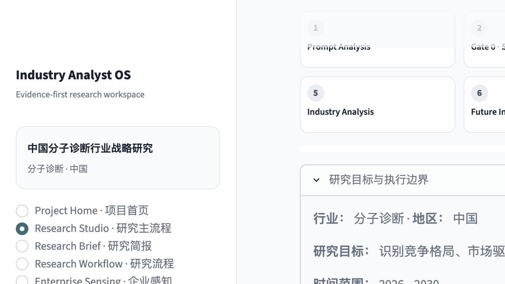
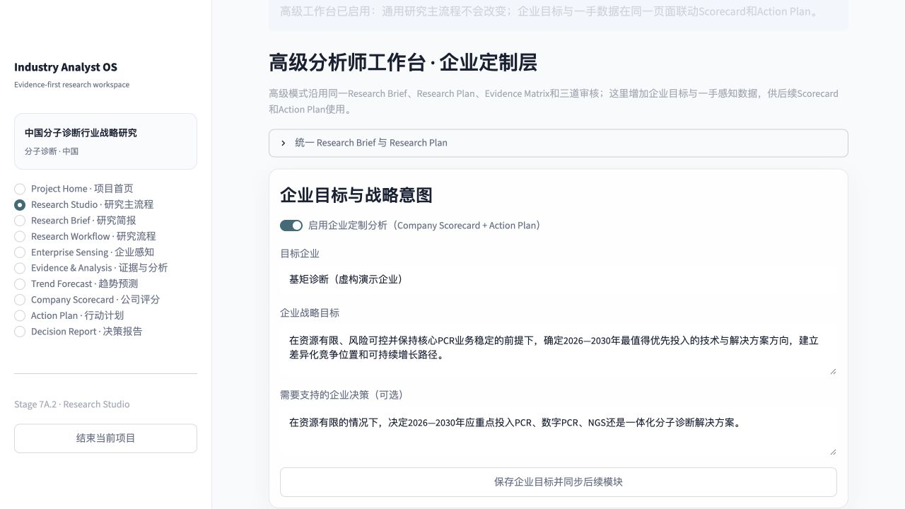
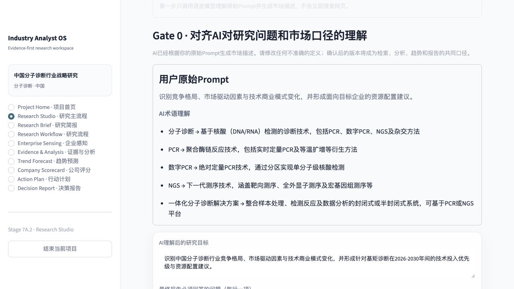

# Stage 7A.3 Product Flow Audit

## Audit scope

Flow: project entry → Research Studio → advanced enterprise layer → AI Prompt
Analysis → Gate 0 market-scope review. Evidence batch controls were verified by
Streamlit component tests because completing all live search tasks would add
provider latency without changing the control rendering.

User goal: begin an industry study from natural language, align the market
definition, review evidence efficiently, and optionally connect enterprise
inputs to Scorecard and Action Plan without leaving the common research state.

## Step 1 — Project entry · Healthy

- General research keeps company fields hidden until the enterprise path is
  enabled, reducing irrelevant form load.
- The original research objective is visually identified as the primary Prompt.
- The case remains clearly labelled as a demonstration, not the only industry.

## Step 2 — Common Research Studio · Healthy after fix

- Quick and advanced modes share one state and one progress sequence.
- Eight progress cards initially rendered incorrectly because Markdown treated
  seven cards as code; compact HTML fixed the issue and all eight now render as
  visible cards.
- The initial action clearly says it interprets the Prompt before web search.

## Step 3 — Advanced enterprise layer · Healthy

- Company target, strategic objective, decision context, Enterprise Sensing
  counts, and downstream eligibility are visible in the main flow.
- General Report remains available when enterprise inputs are missing.
- Scorecard and Action Plan expose their missing conditions instead of silently
  disappearing.
- A quick first-party observation can be added inline; full file intake and
  review remain available in Enterprise Sensing.

## Step 4 — Gate 0 market scope · Healthy

- The configured language model generated a market description from the
  original Prompt.
- The screen preserves the original Prompt and shows the model's terminology
  interpretation before editable fields.
- Must-answer questions, sizing basis, competitor definition, inclusions,
  exclusions, adjacent markets, and ambiguities are editable.
- Web research cannot start until the user confirms this scope.

## Evidence review controls · Healthy by component test

Gate 1 exposes `采用全部系统推荐`, `一键全选`, and `全部取消` before the editable
Evidence Matrix. The final truth/usability confirmation remains required, so
batch selection improves speed without removing human accountability.

## Accessibility and evidence limits

- Primary buttons retain white text on the teal background.
- Progress cards use text and numbers/checkmarks rather than color alone.
- A responsive two-column progress grid is defined below 760px, but the current
  in-app browser did not expose a viewport-resize control, so full keyboard,
  screen-reader, and physical-phone verification remains pending.
- Screenshot review cannot establish full WCAG compliance.

## Highest-impact next checks

1. Run the deployed Streamlit URL on a physical phone after cloud deployment.
2. Verify keyboard focus order through Gate 0 and both data editors.
3. Add PDF/DOCX report export after the report structure is accepted.
